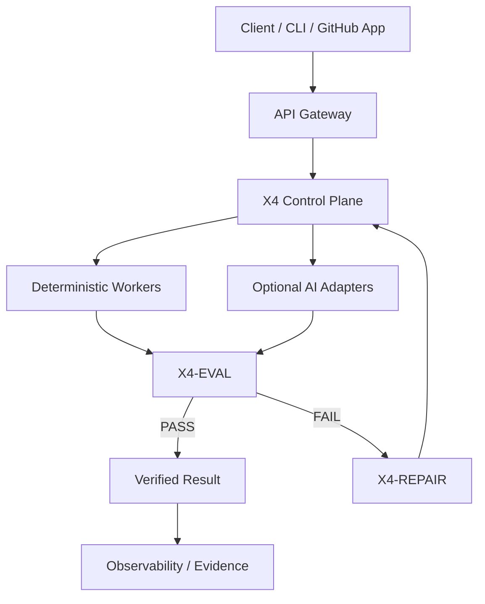

# Arise GenOps / ARIEX4OPS — `arise-v9`

> **Governed engineering baseline for the ARIEX ecosystem.**

## Current state — OBSERVED

This repository is the **governance, documentation, configuration-template,
and verification baseline** for Arise GenOps. It does not currently contain the
application packages described by the historical v9-Core documentation.

The historical `packages/cad-automation`, `packages/ai-agents`,
`packages/web-dashboard`, and `packages/devops-tools` trees are not present in
the current repository. CI therefore must not pretend to build or test them.

## X4 alignment

The repository is aligned with the X4 deterministic-first evidence model:

```text
OBSERVED → CORRELATED → HYPOTHESIS → VALIDATED → UNKNOWN
```

Target X4 layers are implemented only when executable source and verification
evidence exists.

## Architecture blueprint



## Repository blueprint

```text
arise-v9/
├── .arx4/
├── .github/
├── docs/
├── scripts/
├── .env.example
├── .gitignore
├── LICENSE
├── README.md
└── SECURITY.md
```

## Completion gates

```text
Architecture
  ↓
Executable implementation
  ↓
Unit tests
  ↓
Integration tests
  ↓
Security / secret scan
  ↓
CI
  ↓
Deployment
  ↓
Live health check
  ↓
Evidence recorded
  ↓
VERIFIED
```

## Incomplete work — explicitly tracked

- [ ] Restore application packages only when their source boundaries are defined.
- [ ] Add executable vertical slices for restored packages.
- [ ] Add package-level unit and integration tests.
- [ ] Add security/secret scanning for application code.
- [ ] Add deployment and live-health evidence when deployment is introduced.
- [ ] Keep target-state diagrams separate from observed implementation.

## Current CI model

```text
checkout
   ↓
shell syntax validation
   ↓
repository verification
   ↓
quality gate
```

The workflow intentionally remains small while the application package tree is
absent.

## Security contract

1. Never commit credentials.
2. Never delete tests to make CI green.
3. Never suppress a quality gate with `|| true`.
4. Never claim deployment without evidence.
5. Preserve unknown state until it is verified.

## Evidence rule

**Blueprint ≠ implementation. Implementation ≠ verification.**
A project becomes `VERIFIED` only after the relevant gates actually execute and
produce reproducible evidence.
